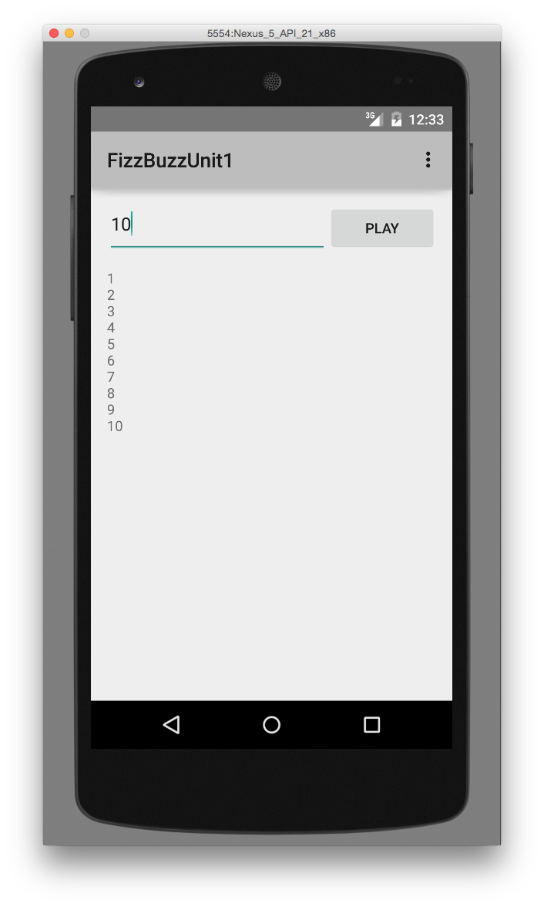
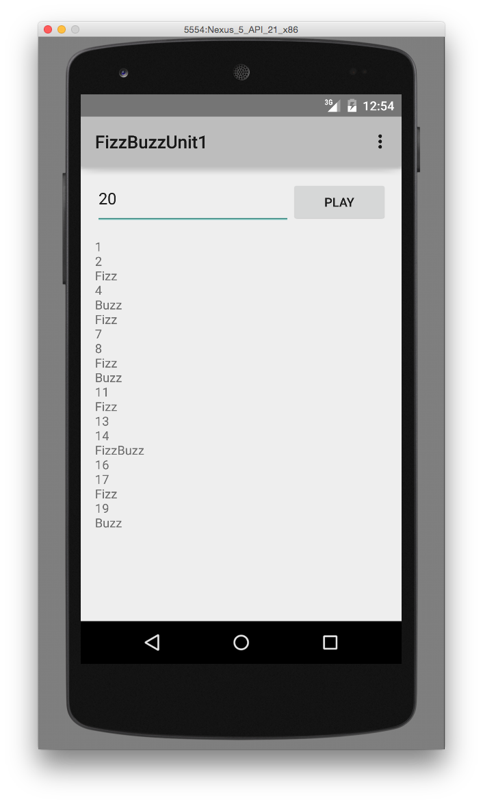
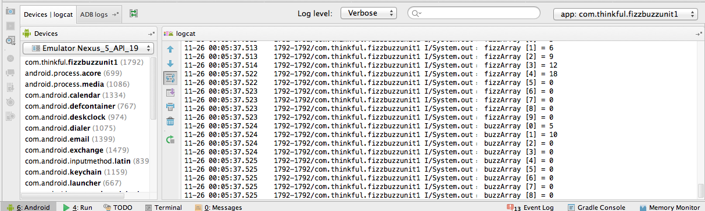

AndroidFizzBuzz
===============

This is the source code for the Thinkful Android Fizz Buzz App for Unit 1. 

This app is purposely incomplete. With your newly learned java skills your task is to complete this project and run it in the emulator.

Here are the requirements:

1. Declare `String` variables for the words "Fizz", "Buzz", and "FizzBuzz". (Unit 1 Lesson 2 Assignment 1)
2. Create a `for` loop inside the doButton method that will iterate the number of times given by the user.(Unit 1 Lesson 2 Assignment 2)

3. For each iteration of the loop, display the string of either the number, "Fizz", "Buzz", or "FizzBuzz" depending on the value. (Unit 1 Lesson 2 Assignment 3)

4. Create an array of indicies for each "Fizz", and "Buzz" word, then display the arrays in the console. (Unit 1 Lesson 2 Assignment 4)

Here's the definition from wikipedia on what is [Fizz Buzz](http://en.wikipedia.org/wiki/Fizz_buzz)

> Fizz buzz is a group word game for children to teach them about division.Players take turns to count incrementally, replacing any number divisible by three with the word "fizz", and any number divisible by five with the word "buzz"... Numbers divisible by both become "fizz buzz".

